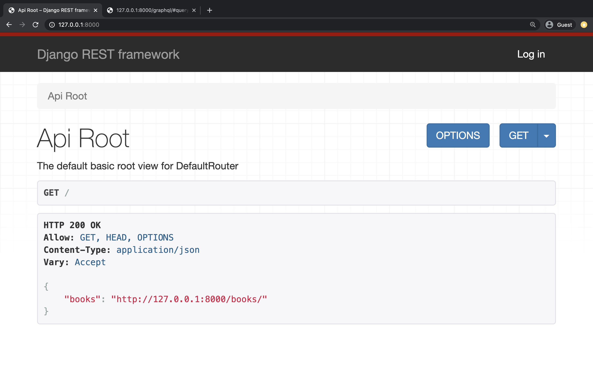
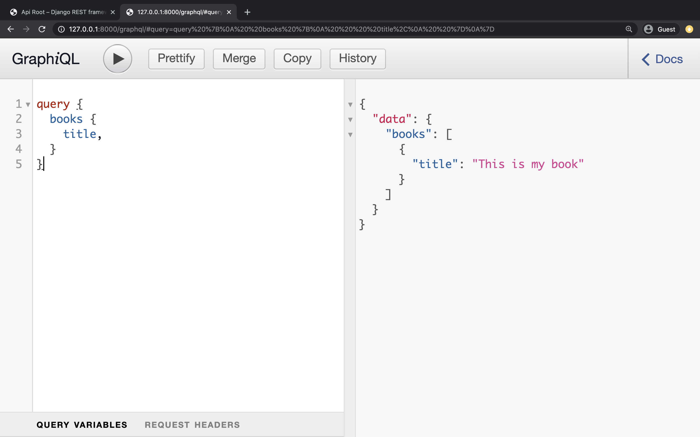
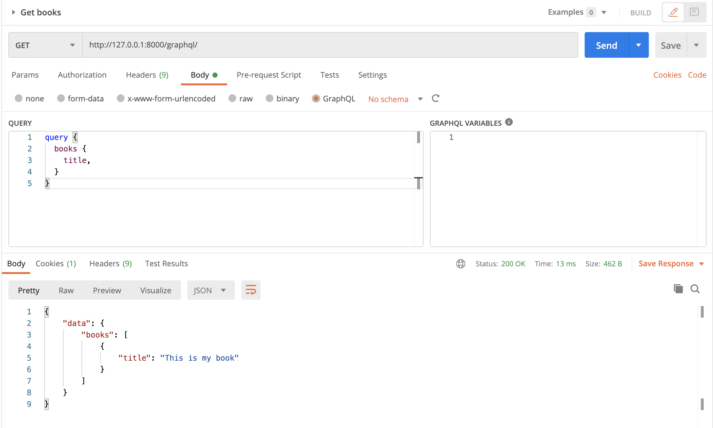

# Django Sample

### Installation

Install python dependencies
```bash
pip install -r requirements.txt 
```

Migrate database
```bash
./manage.py migrate
```

Import database from file
```base
./manage.py loaddata data.json
```

### Start
```bash
./manage.py runserver
```

### Result
Rest Framework: http://127.0.0.1:8000/


GraphQL Django: http://127.0.0.1:8000/graphql


Postman:



### Related Libraries
- [Rest Framwork](https://www.django-rest-framework.org/)
- [GraphQL Django](https://github.com/graphql-python/graphene-django)
  